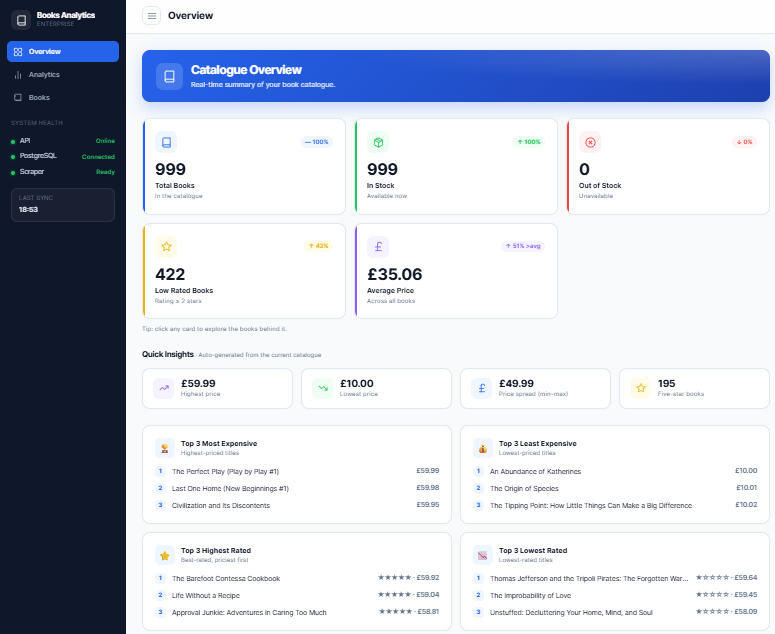
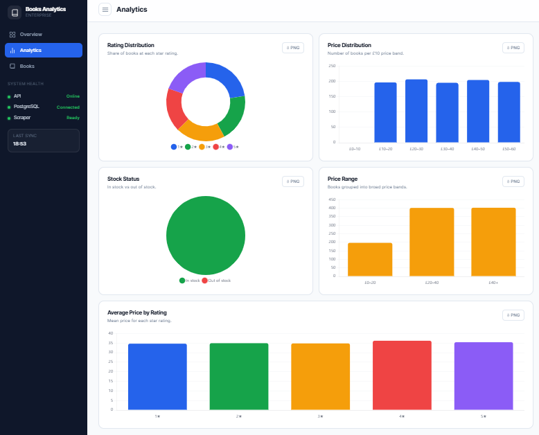
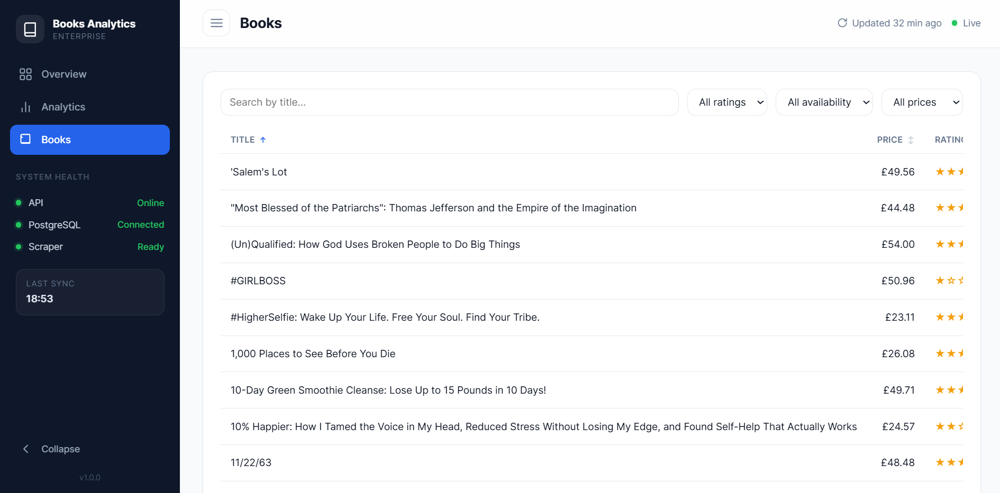

# Books Analytics — Full-Stack Data Engineering Take-Home

An end-to-end application that **scrapes** book data from a public website,
**stores it in PostgreSQL, **serves** it through a **FastAPI** REST API, and
**visualises** it in a modern analytics **dashboard** all runnable with a single
command:

```bash
docker compose up
```

---

## Overview

The pipeline follows a classic data-engineering flow: scrape → clean → store →
serve → visualise.

- **Data source:** [Books to Scrape](https://books.toscrape.com) — a sandbox site
  built for scraping practice (~1,000 books across 50 pages). For each book we
  collect **title, price, star rating, and availability**.
- **Cleaning & normalisation:** prices are parsed to floats, star ratings mapped
  from words to integers (`"Three" → 3`), availability parsed to a boolean, and
  duplicate titles collapsed.
- **Idempotency:** the scraper uses a PostgreSQL **UPSERT** (`INSERT … ON CONFLICT`)
  on a unique `title`, so re-running it never creates duplicate rows.
- **API:** a small, sensible REST API over the stored data (JSON only).
- **Dashboard:** a single-page analytics UI that reads exclusively from the API
  (never directly from the database).

> **Note on data honesty:** every number shown in the dashboard is derived from
> the real scraped data. There are no simulated or placeholder metrics.

---

## Features

- Scrapes all 50 pages (~1,000 books) with a polite request delay.
- Clean PostgreSQL schema with a primary key and a unique constraint.
- Idempotent ingestion (safe to re-run).
- REST API with list, detail, search, and aggregate-stats endpoints + Swagger docs.
- Analytics dashboard: KPI cards, quick insights, Top-3 highlights, distribution
  charts, and a searchable/sortable/paginated data table.
- Fully containerised — `docker compose up` builds and runs the whole stack and
  auto-seeds the database on first boot.

---

## Architecture

```
        Books to Scrape (books.toscrape.com)
                    │   HTTP + BeautifulSoup
                    ▼
             Python Scraper           (scraper/scraper.py)
                    │   clean + de-duplicate
                    ▼
             PostgreSQL               (books table, unique title)
                    ▲   SQLAlchemy ORM (UPSERT)
                    │
                 FastAPI              (backend/ — REST API, JSON)
                    ▲
                    │   fetch() over HTTP
                    ▼
          Frontend Dashboard          (frontend/ — nginx, vanilla JS + Chart.js)
```

**Runtime (Docker Compose):**

```
frontend (nginx)      →  http://localhost:8080   (static dashboard)
backend  (FastAPI)    →  http://localhost:8000   (REST API + /docs)
postgres              →  localhost:5432           (persisted in a named volume)
```

The backend talks to PostgreSQL over the internal Docker network (host `postgres`).
The browser calls the backend on the published host port `8000`.

---

## Technologies Used

| Layer      | Technology |
|------------|------------|
| Scraper    | Python 3.11, Requests, BeautifulSoup |
| Database   | PostgreSQL 16 |
| ORM        | SQLAlchemy 2 |
| API        | FastAPI + Uvicorn |
| Frontend   | HTML, CSS, vanilla JavaScript, Chart.js (vendored locally) |
| Infra      | Docker, Docker Compose, nginx |

---

## Folder Structure

```
Fullstack_Case/
├── backend/
│   ├── Dockerfile          # backend image (build context = project root)
│   ├── start.py            # container entrypoint: wait-for-db, create tables, seed, run API
│   ├── main.py             # FastAPI app + routes
│   ├── crud.py             # all database reads/writes (incl. UPSERT)
│   ├── models.py           # SQLAlchemy ORM model (books table)
│   ├── schemas.py          # Pydantic response models
│   ├── database.py         # engine, SessionLocal, get_db dependency
│   └── seed.py             # scrape → store ingestion script
├── frontend/
│   ├── Dockerfile          # nginx static-serve image
│   ├── index.html          # dashboard structure
│   ├── style.css           # design system
│   ├── data.js             # API calls + derived metrics
│   ├── charts.js           # Chart.js wrapper
│   ├── app.js              # UI orchestration (tabs, table, modals)
│   └── vendor/             # Chart.js (vendored for offline use)
├── scraper/
│   └── scraper.py          # BooksToScrape scraper (returns clean dicts)
├── docker-compose.yml      # postgres + backend + frontend
├── requirements.txt        # Python dependencies
├── .dockerignore
├── .env.example            # copy to .env to override defaults (optional)
└── README.md
```

---

## Prerequisites

- [Docker Desktop](https://www.docker.com/products/docker-desktop/) (includes
  Docker Compose). On Windows, WSL2 is recommended.

That's it — you do **not** need Python, Node, or PostgreSQL installed locally to
run the app.

---

## Installation & Running

```bash
# 1. Clone the repository
git clone <your-repo-url>
cd Fullstack_Case

# 2. Start everything
docker compose up
```

Then open:

- **Dashboard:** http://localhost:8080
- **API docs (Swagger):** http://localhost:8000/docs

On the **first** run, the backend automatically scrapes ~1,000 books and seeds the
database (about a minute — you'll see progress in the logs). On subsequent runs it
detects existing data and starts instantly.

To stop:

```bash
docker compose down        # stop (keeps the database)
docker compose down -v     # stop and wipe the database volume
```

### Triggering a re-scrape

Ingestion runs automatically on first boot. To re-run the scrape manually (it
upserts, so no duplicates are created):

```bash
docker compose exec backend python seed.py
```

Or force a completely fresh scrape by wiping the volume: `docker compose down -v`
then `docker compose up`.

---

## Environment Variables

The stack runs with sensible defaults and needs **no** `.env` file. To override,
copy `.env.example` to `.env`:

| Variable      | Default     | Description |
|---------------|-------------|-------------|
| `DB_HOST`     | `postgres`  | Database host (service name inside Docker; `localhost` for local dev) |
| `DB_PORT`     | `5432`      | Database port |
| `DB_NAME`     | `books_db`  | Database name |
| `DB_USER`     | `postgres`  | Database user |
| `DB_PASSWORD` | `password`  | Database password |

---

## Database Schema

Table: **`books`**

| Column         | Type              | Constraints                     |
|----------------|-------------------|---------------------------------|
| `id`           | INTEGER           | Primary key, auto-increment     |
| `title`        | VARCHAR           | NOT NULL, **UNIQUE**            |
| `price`        | DOUBLE PRECISION  | NOT NULL                        |
| `rating`       | INTEGER           | NOT NULL (1–5)                  |
| `availability` | BOOLEAN           | NOT NULL                        |

The `UNIQUE` constraint on `title` is the natural key that makes the UPSERT
idempotent.

---

## API Endpoints

Base URL: `http://localhost:8000`

| Method | Endpoint            | Description                                        |
|--------|---------------------|----------------------------------------------------|
| GET    | `/health`           | Liveness check → `{"status":"ok"}`                 |
| GET    | `/books`            | List all books                                     |
| GET    | `/books/{id}`       | Get a single book by id (404 if not found)         |
| GET    | `/books/search?q=`  | Case-insensitive title search (the query parameter)|
| GET    | `/stats`            | Aggregate stats (totals, average price, per-rating)|

Examples:

```bash
curl http://localhost:8000/books/360
curl "http://localhost:8000/books/search?q=light"
curl http://localhost:8000/stats
```

Interactive documentation is available at `/docs` (Swagger UI).

---

## Dashboard Screenshots

> _Placeholders — replace with real screenshots before submission._

| Overview | Analytics | Books |
|----------|-----------|-------|
|  |  |  |

---

## Future Improvements

If I had more time, I would like to:

- Collect additional book information such as categories and descriptions.
- Add automated tests to improve reliability.
- Schedule automatic data updates instead of running the scraper manually.
- Improve the API to handle larger amounts of data more efficiently.
- Strengthen error handling and logging for better stability.
- Improve deployment and project scalability for production use.
- Use database migrations to make future database updates easier to manage.

```
